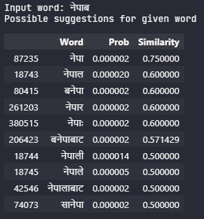

# Nepali Text Autocorrection System

## Author: [Anish Shilpakar](https://github.com/JuJu2181)

## About this project
Text autocorrection system is a software application that is designed to automatically correct errors in text input by suggesting the most appropriate corrections. The system uses algorithms to analyze the input text and compare it with a database of correct words, phrases or sentences, and provides suggestions for corrections in real-time.

Text autocorrection systems are essential tools for improving the accuracy and efficiency of text-based communication, especially in situations where the input is prone to errors. For example, in mobile devices, text messages, emails, and other applications, text autocorrection can significantly reduce the time required to type and edit text, making it easier and faster for users to communicate.

The scope of text autocorrection systems is vast, as it can be used in various applications, including but not limited to social media, instant messaging, search engines, email clients, and document editors. Additionally, text autocorrection systems can be implemented in different languages, making them beneficial for users worldwide, irrespective of their language proficiency. 

In this project I have implemented a simple text autocorrection system for Nepali language. For this project, I have taken this dataset [Nepali words dictionary](https://www.kaggle.com/datasets/sangamthapa/nepali-dictionary) from Kaggle. This Nepali text autocorrection system utilizes Jaccard Similarity and Levenshtein Distance algorithms to suggest the most similar words to a given input word. By leveraging these algorithms, the system provides accurate and efficient corrections to Nepali text, enhancing the overall user experience. As this system is still in development, it may not be accurate as of now, but it will be improved as time moves on. 

### Programming Language Used
- Python

### Project Structure:
- nepali_autocorrection.ipynb is notebook where I have implemented the nepali text autocorrection using textdistance library as well as from scratch
- nep_autocorrect.py is python script to get the suggested words for given input word
- nep_dict_words.txt is the collection of Nepali words used to create vocabulary in this project.

### Output:

> If you want to contribute to this project, feel free to fork this project and send pull requests for your contributions. And if you like this project, don't forget to leave a ⭐ in this repository